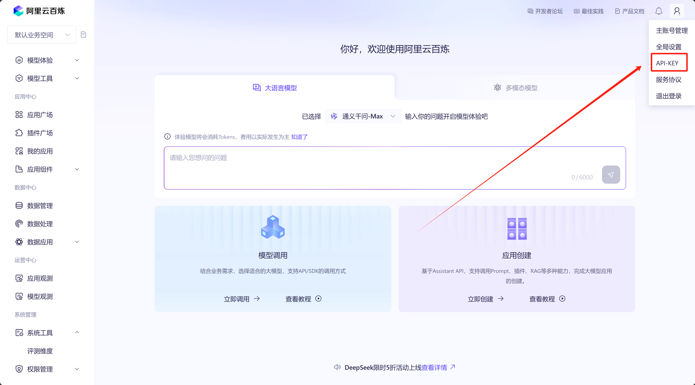

# 环境准备
```bash
git clone https://github.com/ZKP0525/A_Share_investment_Agent.git
cd A_Share_investment_Agent


conda create -n asia python=3.10 
conda activate asia 
pip install poetry openai
poetry install
poetry update akshare
```

前往[阿里云百炼平台](https://bailian.console.aliyun.com/#/home)获取api-key，将获取到的api-key添加到目录下的.env文件中。


# 使用方法

```bash
poetry run python src/main.py --ticker 000818 --show-reasoning --start-date 2025-02-17 --end-date 2025-02-23 --num-of-news 20 --initial-capital 100000 --initial-position 30000
```
根据需要更改股票代码、新闻获取起始结束时间、仓位，即可获得投资建议。

一次运行结果不一定准确，可以针对一支股票多跑两次。

### 命令解释：
- ticker: 股票代码
- show-reasoning：详细解释
- start-date: 搜集新闻开始日期（YYYY-MM-DD）
- end-date: 搜集新闻结束日期（YYYY-MM-DD）
- initial-capital: 初始资金（可选，默认为 100,000）
- initial-position: 初始仓位
- num-of-news: 情绪分析使用的新闻数量（可选，默认为 5，最大为 100）

### 输出说明
系统会输出以下信息：

1. 基本面分析结果
2. 估值分析结果
3. 技术分析结果
4. 情绪分析结果
5. 风险管理评估
6. 最终交易决策

如果使用了`--show-reasoning`参数，还会显示每个智能体的详细分析过程。
